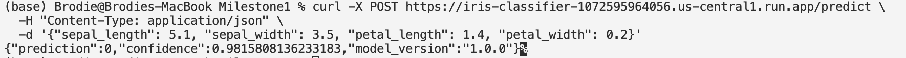
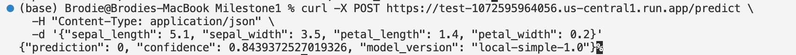

# Milestone 1

## Part 1 - FastAPI Service (Local)
### Local Model Serving Lifecycle

This local FastAPI service represents the **model serving stage** of the ML lifecycle.

**Lifecycle flow:**
User Input → API Schema Validation → Model Inference → API Response → Consumer

1. **Input**  
   A client sends a JSON request to the `/predict` endpoint containing feature values.

2. **API (FastAPI + Pydantic)**  
   FastAPI receives the request and Pydantic validates the schema and data types before inference.

3. **Model**  
   A pre-trained scikit-learn classification model (`model.pkl`) is loaded at application startup and reused for all requests.

4. **Response**  
   The API returns a structured JSON response with the prediction, confidence score, and model version.

5. **Consumer**  
   The response can be consumed by local clients, downstream services, or later deployed cloud consumers.

This setup demonstrates how a trained ML artifact is integrated into an API for reproducible and maintainable inference.

### Local Run Instructions
```bash

# 1. Create virtual environment
python -m venv venv
source venv/bin/activate

# 2. Install dependencies
pip install -r requirements.txt

# 3. Train and save model artifact
python train_model.py

# 4. Run FastAPI locally
uvicorn main:app --reload

# 5. Health check
curl http://localhost:8000/health

# 6. Test prediction endpoint
curl -X POST http://localhost:8000/predict \
  -H "Content-Type: application/json" \
  -d '{
    "sepal_length": 5.1,
    "sepal_width": 3.5,
    "petal_length": 1.4,
    "petal_width": 0.2
  }'

```

## Part 2 - Cloud Run Deployment
### Step 1 - Settings
```bash
gcloud init
gcloud services enable artifactregistry.googleapis.com run.googleapis.com cloudbuild.googleapis.com
## create a repository
gcloud artifacts repositories create ml-models \
  --repository-format=docker \
  --location=us-central1
```
### Step 2 - Update & Deploy

```bash
export PROJECT_ID="ml568-486203"
export REGION="us-central1"
export REPO_NAME="ml-models"
export IMAGE_NAME="iris-classifier"
export TAG="v2"
export FULL_IMAGE_PATH="${REGION}-docker.pkg.dev/${PROJECT_ID}/${REPO_NAME}/${IMAGE_NAME}:${TAG}"

# for Macbook users, sometimes you need to use gcloud builds rather than docker build
gcloud builds submit --tag ${FULL_IMAGE_PATH}

# deploy to cloud 
gcloud run deploy ${IMAGE_NAME} \
  --image ${FULL_IMAGE_PATH} \
  --region ${REGION} \
  --allow-unauthenticated \
  --port 8080

# Service URL:
# https://iris-classifier-1072595964056.us-central1.run.app
# Artifact Registry Image location: 
# us-central1-docker.pkg.dev/ml568-486203/ml-models/iris-classifier@sha256:28c4e51639f2349b86ba9b7a66c042017d31036471eeada6093a22c35c822ed9

```
### API usage example
```bash
curl -X POST https://iris-classifier-1072595964056.us-central1.run.app/predict \
  -H "Content-Type: application/json" \
  -d '{"sepal_length": 5.1, "sepal_width": 3.5, "petal_length": 1.4, "petal_width": 0.2}'

https://test-1072595964056.us-central1.run.app/
# Expect output:
# {"prediction":0,"confidence":0.9815808136233183,"model_version":"1.0.0"}%   
```


### Brief analysis of cold start behavior and lifecycle implications
Cloud Run instances are created on demand. During a cold start, the container
initializes, dependencies are loaded, and the model artifact is loaded into memory,
resulting in higher latency for the first request. Subsequent requests are served
by warm instances with significantly lower latency. The model is loaded once per
container lifecycle, aligning with a stateless request-handling pattern but
stateful in-memory model usage per instance.

## Part 3 - Serverless Function (GCP Functions)
### Code implementation
#### main.py
```bash
# main.py - Cloud Function with local sklearn model (no model.pkl)

import functions_framework
import json
import numpy as np
from sklearn.linear_model import LogisticRegression

# Global model (initialized at cold start, reused by warm instances)
model = None

def load_model():
    """Initialize a lightweight local model once per instance."""
    global model
    if model is None:
        # Minimal training data (simulated)
        X = np.array([
            [5.1, 3.5, 1.4, 0.2],
            [6.2, 3.4, 5.4, 2.3],
        ])
        y = np.array([0, 1])

        clf = LogisticRegression()
        clf.fit(X, y)
        model = clf

    return model


@functions_framework.http
def predict(request):
    """HTTP Cloud Function for iris prediction."""
    request_json = request.get_json(silent=True)

    if not request_json:
        return json.dumps({"error": "No JSON provided"}), 400

    required_fields = [
        "sepal_length",
        "sepal_width",
        "petal_length",
        "petal_width",
    ]

    for field in required_fields:
        if field not in request_json:
            return json.dumps({"error": f"Missing field: {field}"}), 400

    clf = load_model()

    features = np.array([[
        request_json["sepal_length"],
        request_json["sepal_width"],
        request_json["petal_length"],
        request_json["petal_width"],
    ]])

    prediction = int(clf.predict(features)[0])
    confidence = float(clf.predict_proba(features).max())

    return json.dumps({
        "prediction": prediction,
        "confidence": confidence,
        "model_version": "local-simple-1.0"
    })

```
#### requirements.txt
```bash
functions-framework==3.*
scikit-learn==1.3.2
numpy==1.26.4

```

### Deployment Configuration (Cloud Function)

- Runtime: Python 3.11
- Entry point: predict
- Trigger type: HTTP
- Authentication: Allow unauthenticated
- Region: us-central1
- Execution model: Serverless (Gen2)

### API usage example
```bash
curl -X POST https://test-1072595964056.us-central1.run.app/predict \
  -H "Content-Type: application/json" \
  -d '{"sepal_length": 5.1, "sepal_width": 3.5, "petal_length": 1.4, "petal_width": 0.2}'

# Expected output:
# {"prediction": 0, "confidence": 0.8439372527019326, "model_version": "local-simple-1.0"}%     
```

### GCP function logs example
```bash
{
httpRequest: {14}
insertId: "6982cda700096a58cfefdbd0"
labels: {1}
logName: "projects/ml568-486203/logs/run.googleapis.com%2Frequests"
payload: "payloadNotSet"
receiveLocation: "us-central1"
receiveTimestamp: "2026-02-04T04:40:07.622652296Z"
resource: {2}
severity: "INFO"
spanId: "e489b1ce2750d699"
timestamp: "2026-02-04T04:40:07.551877Z"
trace: "projects/ml568-486203/traces/d078f2cf0a8367af78e24c38bd52e7c2"
traceSampled: true
}
```
```bash
# Artifact Registry Image location: 
us-central1-docker.pkg.dev/ml568-486203/cloud-run-source-deploy/test@sha256:03f99fb88c3950364efed21df7bfe0591b35dc98ef9df5ee90ea4983f270ddef
```
## FastAPI Container vs Cloud Function Comparison

**Lifecycle (Stateful vs Stateless)**  
The FastAPI service on Cloud Run runs inside a container where the model is loaded
once at startup and reused across multiple requests, making the instance stateful
at the container level. In contrast, Cloud Functions follow a stateless execution
model where each invocation is independent, although warm instances may temporarily
reuse in-memory state.

**Artifact Loading**  
For Cloud Run, the model artifact (`model.pkl`) is baked into the container image and
loaded during container initialization. For Cloud Functions, the model is deployed
together with the function source code and loaded at cold start.

**Latency Characteristics**  
Cloud Run exhibits higher latency during cold starts due to container startup and
model loading, but provides lower and more stable latency for warm requests. Cloud
Functions generally have faster cold starts for simple workloads, but cold start
latency is still noticeable when new instances are created.

**Reproducibility**  
Cloud Run offers stronger reproducibility by using a versioned container image
and pinned dependencies. Cloud Functions rely on source-based deployment and pinned
dependencies, which provides reasonable reproducibility but less strict environment
control compared to containerized deployment.
